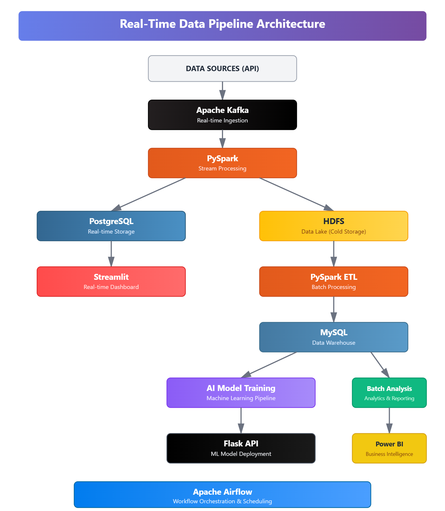
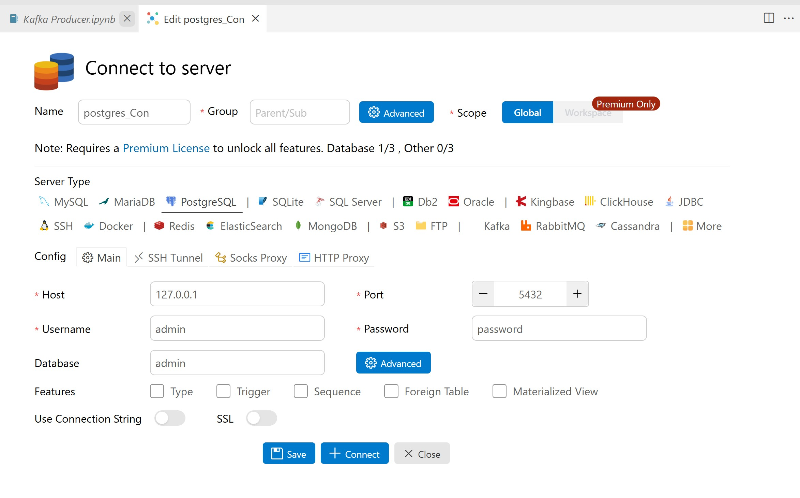
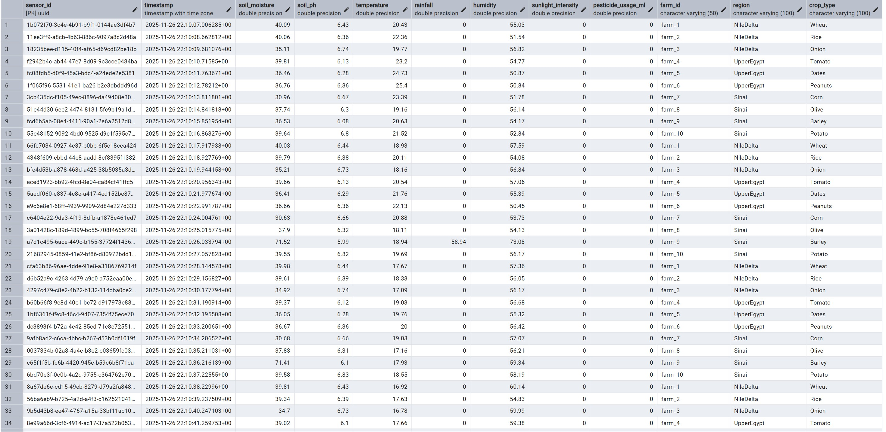
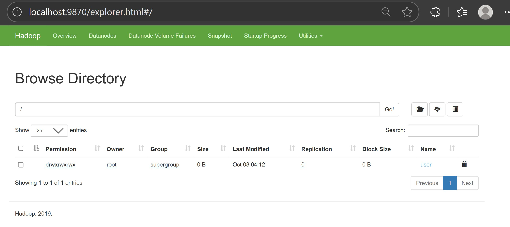
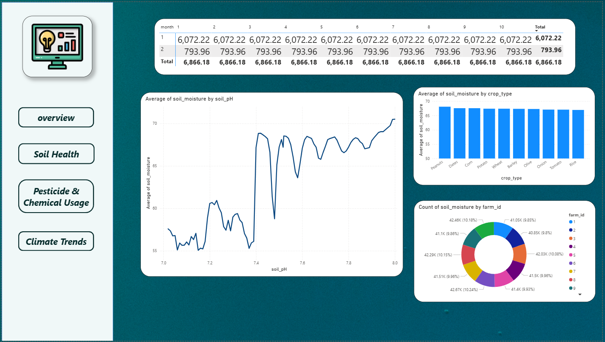
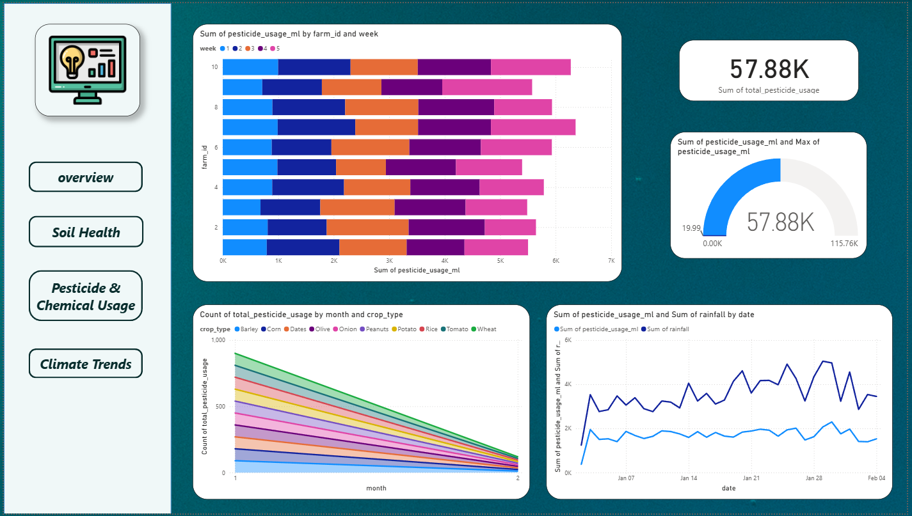

# 🌾 Smart Agriculture IoT Pipeline for Crop Yield Optimization

[](https://www.python.org/)
[](https://kafka.apache.org/)
[](https://spark.apache.org/)
[](https://airflow.apache.org/)
[](https://www.docker.com/)
[](https://www.postgresql.org/)
[](https://hadoop.apache.org/)
[](https://www.mysql.com/)
[](https://streamlit.io/)
[](https://jupyter.org/)
[](https://flask.palletsprojects.com/)
[](https://powerbi.microsoft.com/)


## 📋 Overview

A comprehensive **Smart Agriculture IoT Data Pipeline** designed to optimize crop yield and irrigation efficiency through real-time data processing and predictive analytics. This system addresses critical agricultural challenges including water scarcity, resource waste, and lack of real-time monitoring by leveraging IoT sensor data and machine learning.

### 🎯 Key Features

- **Real-time Data Processing**: Instant insights from IoT sensors (soil moisture, temperature, rainfall)
- **Predictive Analytics**: AI-powered irrigation forecasting and anomaly detection
- **Dual Processing Architecture**: Both streaming and batch processing pipelines
- **Automated Workflows**: End-to-end orchestration with Apache Airflow
- **Interactive Dashboards**: Real-time visualization with Streamlit
- **Scalable Storage**: PostgreSQL for stream data, HDFS for cold storage, MySQL data warehouse

## 🏗️ System Architecture

<p align="center">
  
</p>

### 🔄 Data Flow

1. **Ingestion**: External IoT data fetched via API → Apache Kafka topics
2. **Stream Processing**: Kafka → PySpark → PostgreSQL + HDFS
3. **Real-time Analytics**: PostgreSQL → Streamlit dashboards
4. **Batch Processing**: HDFS → PySpark ETL → MySQL Data Warehouse
5. **AI Pipeline**: MySQL DWH → Model Training → Flask API
6. **Orchestration**: Apache Airflow manages all workflows

---

## 🎯 Objectives

- ✅ Build real-time data ingestion pipeline using Apache Kafka
- ✅ Process streaming and batch data with PySpark
- ✅ Implement dual storage: PostgreSQL (real-time) + HDFS (long-term)
- ✅ Design ETL jobs for MySQL data warehouse population
- ✅ Develop interactive Streamlit dashboards
- ✅ Train and deploy AI models for predictive analytics
- ✅ Host AI models via Flask REST API
- ✅ Automate workflows with Apache Airflow

---
# 🚀 Complete Setup Guide

This comprehensive guide will walk you through deploying the entire Smart Agriculture IoT Pipeline on your local machine. Each step is explained in detail to help you understand not just what to do, but why each component is necessary and how they work together.

---

## 📋 Prerequisites

Before beginning the installation, ensure your development environment meets these requirements:

**Required Software:**
- Docker Desktop (version 20.10 or higher) with at least 8GB RAM allocated
- Python 3.8 or higher installed with pip package manager
- Anaconda or Miniconda for managing Python environments
- Visual Studio Code with PostgreSQL extension (or pgAdmin as an alternative)
- Jupyter Notebook for running Spark jobs
- A modern web browser (Chrome, Firefox, or Edge)

**System Resources:**
- Minimum 16GB RAM (8GB allocated to Docker, 8GB for host OS and applications)
- At least 50GB free disk space for Docker volumes and data storage
- Stable internet connection for downloading Docker images and dependencies

**Knowledge Prerequisites:**
- Basic familiarity with command line operations
- Understanding of database concepts (tables, queries, connections)
- Basic knowledge of Python programming
- Awareness of distributed computing concepts (helpful but not mandatory)

---
## 🗺️ Step 0: Generate and Prepare Sensor Data
### Understanding the Data Source

Before diving into the real-time pipeline, it's essential to understand where the data originates and how it's prepared for streaming. In a production agricultural IoT system, physical sensors deployed across farms would continuously measure environmental conditions and transmit readings to a central platform. However, for development, testing, and demonstration purposes, we simulate this sensor network using a data generation script that creates realistic agricultural data patterns.

### The Farm Network Setup

The data generation process simulates a network of **10 farms** distributed across 3 major agricultural regions in Egypt. Each farm is configured with specific characteristics that influence its sensor readings:

**🌊 Nile Delta Region (3 farms)** Wheat, rice, onions | High humidity, moderate temps

**🏜️ Upper Egypt Region (3 farms)** Tomatoes, dates, peanuts | Desert heat, low rainfall

**⛰️ Sinai Region (4 farms)** Corn, olives, barley, potatoes | Unique microclimate

### 🔄Realistic Sensor Data Simulation

Year-long (2024) minute-by-minute data modeling environmental interactions and agricultural practices.

## Key Variables 
**Sunlight:** 6 AM-6 PM, noon peak, seasonal variation

**Temperature:** 18-22°C (winter) to 28-35°C (summer), daily/regional fluctuations

**Soil Moisture:** Evapotranspiration loss, rainfall gain, irrigation at <20%

**Rainfall:** 1.4% probability/minute, 10-80mm amounts

**Humidity:** 55% base, adjusted for temp/rain, ±3% random

**Soil pH:** 6.0-7.0 start, rain/pesticides lower it, moisture raises it

**Pesticides:** 70% after rain, weekly routine, 5-20ml

---
## 🚀 Step 1: Launch the Container Infrastructure

The entire technology stack runs as Docker containers orchestrated by Docker Compose. This approach ensures consistent environments across different machines and simplifies dependency management. Instead of manually installing Kafka, PostgreSQL, Hadoop, and Spark on your machine, Docker handles all installations and configurations automatically.

### What This Step Does

The `docker-compose.yaml` file (Docker Compose configuration) defines all the services needed for the pipeline. When you run the compose command, Docker will pull the required images from Docker Hub and start multiple containers. These containers include:
### Execution Steps

Open your terminal or command prompt and navigate to the project directory where the `docker-compose.yaml` file is located. Execute the following command:
```bash
docker compose up -d
```

### Accessing Service Web Interfaces

Once all containers are running, you can verify their functionality by accessing their web interfaces:

- **Kafka UI**: Open your browser and navigate to http://localhost:8080. You should see the Kafka UI dashboard, though it will show no topics yet.

- **Hadoop NameNode**: Visit http://localhost:9870 to see the HDFS web interface showing cluster overview, filesystem status, and data node information.

- **Spark Master**: Access http://localhost:8081 to view the Spark cluster status, available workers, and resource allocation.

If any of these interfaces don't load, double-check that the corresponding containers are running and that no firewall rules are blocking the ports.

---
## 💾 Step 2: Initialize the Hadoop Distributed File System

HDFS requires specific directory structures to be created before it can store data. Unlike traditional filesystems that create directories automatically, HDFS follows a more explicit initialization process. This step sets up the necessary directory hierarchy for storing your sensor data.

### Why This Step Is Necessary

HDFS organizes data in a distributed manner across multiple nodes. The `/user` directory is a convention in Hadoop ecosystems, similar to `/home` in Unix systems. Applications like Spark expect to write data to user-specific directories within `/user`. Creating these directories upfront prevents permission errors and ensures Spark can write data successfully.

### Execution Steps

First, you need to access the command-line interface inside the Hadoop NameNode container. 

The `docker exec` command runs a command inside a running container. 

Now create the necessary directory structure by running:
```bash
hdfs dfs -mkdir -p /user
```
---
## 🔌 Step 3: Configure PostgreSQL Database Connection

PostgreSQL serves as the real-time database for your streaming pipeline. Before Spark can write data to PostgreSQL, you need to create the database and configure your development environment to connect to it.

- create a connetion either with vs code databasee connections of pgadmin
  this is the conncetion settings in vs code
  
- or use the localhost of pgadmin 
create database and name it **smart_farming**
and create the table with schema in the database

The `sensor_data` table is designed to capture comprehensive information about each sensor reading. Execute the following SQL to create the table:
```sql
CREATE TABLE IF NOT EXISTS public.sensor_data
(
    sensor_id UUID PRIMARY KEY,
    "timestamp" TIMESTAMP WITH TIME ZONE NOT NULL,
    soil_moisture DOUBLE PRECISION,
    soil_ph DOUBLE PRECISION,
    temperature DOUBLE PRECISION,
    rainfall DOUBLE PRECISION,
    humidity DOUBLE PRECISION,
    sunlight_intensity DOUBLE PRECISION,
    pesticide_usage_ml DOUBLE PRECISION,
    farm_id VARCHAR(50),
    region VARCHAR(100),
    crop_type VARCHAR(100)
);
```
---
## 📊 Step 4: Start the Kafka Data Ingestion Pipeline

With the infrastructure ready and database prepared, it's time to start feeding data into the system. The Kafka producer reads sensor data and streams it into the Kafka topic where Spark will consume it.

open kafka ui on http://localhost:8080 to make sure that topic **'smart_farming_data'** is added.

---
## ⚡ Step 5: Launch Spark Structured Streaming

Now that data is flowing into Kafka, Spark Structured Streaming will consume these messages, process them, and write to both PostgreSQL and HDFS simultaneously.

### Understanding Spark's Dual-Write Pattern

Spark Structured Streaming operates on micro-batch processing. Every 10 seconds (the trigger interval), Spark collects all new Kafka messages, processes them as a mini-batch, and writes the results. This approach balances latency (faster than pure batch) with throughput (higher than processing each message individually). The dual-write pattern ensures data lands in both the hot path (PostgreSQL for real-time queries) and cold path (HDFS for historical analysis) with exactly-once semantics, meaning no duplicates and no data loss even if failures occur.

### Execution Steps

Open Jupyter Notebook in localhost. paste the content of `spark.ipynb` notebook.
The notebook contains several cells that:

1. **Initialize the Spark session** with necessary configurations including Kafka and PostgreSQL JDBC libraries
2. **Read from the Kafka topic** using the `readStream` API
3. **Parse JSON messages** into structured DataFrames with proper schema
4. **Apply data quality transformations** including validation, deduplication, and null handling
5. **Write to PostgreSQL** using foreachBatch to leverage JDBC
6. **Write to HDFS** in Parquet format with date-based partitioning
7. **Start the streaming queries** and await termination

Execute all cells in sequence
### Monitoring Execution

After starting the streaming queries, Spark will display status information showing it's processing data. You'll see log output indicating:

- Connection established to Kafka broker
- Number of messages read in each batch
- Number of rows written to PostgreSQL
- Number of rows written to HDFS
- Processing time for each micro-batch

The streaming queries will continue running indefinitely until you manually stop them. For testing, you can let them run for a few minutes to process several batches, then stop the notebook kernel to gracefully shut down the streams.

## ✅ Step 6: Validate Data in PostgreSQL

After Spark has been processing for a few minutes, verify that data is successfully landing in your PostgreSQL database.

### Verification Steps

Open your PostgreSQL client (VS Code or pgAdmin) and connect to the `smart_farming` database. Open a new query editor and execute:
```sql
SELECT * FROM sensor_data;
```

This query retrieves  sensor readings. If everything is working correctly, you should see rows of data with sensor IDs, timestamps, and all your sensor measurements.

<p align="center">
  
</p>
---

## ✅ Step 7: Validate Data in HDFS

The final verification step ensures data is also being written to HDFS for long-term storage and batch processing.

### Accessing the HDFS Web Interface

Open your browser and navigate to http://localhost:9870 to access the Hadoop NameNode web interface. The landing page shows cluster overview including total storage capacity, used space, and data node status.

<p align="center">
  
</p>
---

# Realtime Dashboard (Streamlit)

The dashboard provides real-time monitoring, alerts, and interactive visualizations of sensor data.

### 🚀 Launch Dashboard
a. Run the Streamlit app

```bash
streamlit run agg_streamlit.py
```

**Access at:** `http://localhost:8501`

---

b. Dashboard Features
Real-time sensor readings (soil moisture, temperature, pH, etc.)
Interactive trend charts with threshold alerts
Critical/Warning alerts based on sensor thresholds
Email notifications for alerts (configurable in sidebar)
Farm & Region filtering
Historical data table
Auto-refresh every 1 second

c. Configure Email Alerts (Optional)
In the sidebar of the dashboard:

Enable "Enable Email Alerts"
Enter:
* Farmer's Email: farmer@example.com
* Sender Email: your_email@gmail.com
* Sender Password: Use App Password (for Gmail)

How to get App Password (Gmail):
Go to: https://myaccount.google.com/apppasswords
Generate a 16-character password and use it here.

d. Dashboard Preview


---
# ETL for Smart Farming Project

This part implements an ETL pipeline to process smart farming sensor data. It reads raw data from HDFS, cleans and transforms it, calculates analytics, and loads everything into a MySQL data warehouse with **incremental loading** to prevent duplicate data processing.

The goals were:
- Clean and standardize sensor data
- Handle missing values and remove extreme outliers
- Build fact and dimension tables for analytics
- Implement incremental loading using timestamp-based checkpointing
- Prevent duplicate data through Spark deduplication and MySQL constraints
- Optimize performance by processing only new data on subsequent runs

## Key Features

### Incremental Loading System
- **Checkpoint Mechanism:** Tracks the maximum timestamp of processed data in `/tmp/last_processed_timestamp.txt`
- **Smart Filtering:** Only processes records with timestamps newer than the last checkpoint
- **First Run:** Processes all historical data and saves checkpoint
- **next Runs:** Filters and processes only new data since last run
- **No New Data Detection:** Exits when no new records are available by stopping spark so that it doesn't try to continue processing and cleaning the data

## Data Output
- **Fact table:** `fact_sensor_data`
- **Dimension tables:** `dim_farm`, `dim_crop`, `dim_time`
- **Aggregated tables:** `moisture_trend`, `rain_moisture`, `climate_effect`, `ph_trend`, `rain_pesticide`, `sunlight_daily`, `pesticide_trend`

## ETL Pipeline Steps

### 1. Spark Setup
Created a Spark session for distributed data processing.

### 2. Incremental Data Reading
- **Read from HDFS:** I read the raw data from the HDFS parquet files
- **Get last processed timestamp from checkpoint:** gets only the data that wasn't loaded before


### 3. Data Cleaning
- **Missing Values:** Fill numeric columns with mean values
- **Outlier Removal:** Use IQR method (Q1 - 1.5*IQR, Q3 + 1.5*IQR)
- **Deduplication:** Remove duplicate records using `dropDuplicates()`
- **Text Cleaning:** Trim whitespace from region and crop_type
- **Type Conversion:** Cast numeric fields to double, extract farm_id as integer

### 4. Feature Engineering
Extract temporal features from timestamp:
- Date, year, month, day, week, hour, minute

### 5. Dimensional Modeling

**Fact Table:**
- `fact_sensor_data`: All sensor readings with foreign keys and measurements

**Dimension Tables:**
- `dim_farm` → farm_id (PK), region
- `dim_crop` → crop_type (PK)
- `dim_time` → date, year, month, day, week, hour, minute 

**Aggregated Analytics Tables:**
- `moisture_trend` → Average soil moisture per farm per day
- `rain_moisture` → Total rainfall vs soil moisture per region per day
- `climate_effect` → Soil moisture vs temperature and sunlight per region
- `ph_trend` → Average soil pH per crop and region over time
- `rain_pesticide` → Rainfall vs pesticide usage correlation
- `sunlight_daily` → Total daily sunlight hours per region
- `pesticide_trend` → Pesticide usage trends by crop and region


- **Aggregated Tables in MySQL:**


### 6. Loading to MySQL
- **Mode:** `append` (incremental loads)
- **Column Types:** Explicitly defined using `createTableColumnTypes`
- **Constraints:** primary keys and composite keys prevent duplicates
- **JDBC Connection:** to directly write from Spark to MySQL


- **Example of the data loaded into the MySQL data warehouse (fact_sensor_data table):**


- **The Data Star Schema (Fact and dimension tables):**


### 7. Checkpoint Update
- **After successful load:** It updates the checkpoint with the maximum timestamp of the processed batch


## Data Integrity

### MySQL Constraints
- `dim_farm` → PRIMARY KEY (farm_id)
- `dim_crop` → PRIMARY KEY (crop_type)
- `dim_time` → Composite UNIQUE (date, hour, minute)
- `fact_sensor_data` → Composite UNIQUE (sensor_id, timestamp)

### Spark Deduplication
- `dropDuplicates()` applied on all dimension tables
- Fact table deduplicated by (sensor_id, timestamp)


## Workflow Summary
```
1. Read Parquet files from HDFS
2. Check last processed timestamp
3. Filter for new records only
4. Clean and transform data
5. Create fact/dimension tables
6. Load to MySQL (append mode)
7. Update checkpoint with new max timestamp
8. Next run processes only data after checkpoint
```

# FarmDWH – Agriculture Analytics Dashboard (Power BI)
## Overview

## Soil Health

## Pesticide & Chemical Usage

## Climate Trend


## Overview of the dashboard 
This Power BI dashboard provides real-time insights into farm operations, soil health, pesticide & chemical usage, moisture levels, and climate trends for farms in Egypt (Nile Delta, Sinai, Upper Egypt, and surrounding regions).

The data is sourced from the **farm_dwh** data warehouse (SQL Server / Azure SQL / MySQL – adjust according to your environment).

## Dashboard Pages

| Page                  | Purpose                                                                 |
|-----------------------|-------------------------------------------------------------------------|
| **Overview**          | High-level KPIs: Total pesticide usage (57.88K ml), Avg temperature (24.09°C), Avg humidity (51.79%), Rainfall count (2,644 events) |
| **Soil Health**       | Soil moisture trends, sunlight intensity, temperature extremes per farm |
| **Pesticide & Chemical Usage** | Pesticide consumption by farm, week, crop type, and region. Tracks total usage (ml) and identifies high-usage periods |
| **Climate Trends**    | Weekly/monthly temperature, humidity, and rainfall patterns with min/max/avg gauges |

## Key Metrics & Visuals
- Total Pesticide Usage: **57.88K ml**
- Average Temperature: **24.09°C** (Max 73.8°C | Min 17.47°C)
- Average Humidity: **51.79%** (Max 128.6% | Min 39.4%)
- Rainfall Events: **2,644**
- Soil Moisture (avg): **6.87K**
- Sunlight Intensity (max): **661.7K**

## Data Source
- **Database**: `farm_dwh` (SQL-based data warehouse)
- **Main Fact Tables** (example – update with your actual tables):
  - `fact_pesticide_usage`
  - `fact_weather_daily`
  - `fact_soil_moisture`
  - `fact_crop_yield` (if available)
- **Dimension Tables**:
  - `dim_farm`, `dim_crop`, `dim_date`, `dim_region`

### Connection Details (Power BI)
- Mode: **Import** or **DirectQuery** (currently using Import for performance)
- Gateway: Enterprise gateway (if on-prem SQL) or built-in for cloud

## How to Open & Refresh
1. Open `FarmDWH_Dashboard.pbix` in Power BI Desktop (latest version recommended)
2. Go to **Home → Transform data → Data source settings**
3. Update/clear permissions for the `farm_dwh` server if needed
4. Click **Refresh** to pull the latest data
5. Publish to Power BI Service (if you have a workspace)

## Filters & Slicers Available
- Region (Nile Delta, Sinai, Upper Egypt, etc.)
- Crop Type (Wheat, Rice, Tomato, Potato, Onion, Corn, Dates, Olive, Barley, Peanuts)
- Farm ID
- Date / Week / Month

# ML Models
## 🌾 First Model: Irrigation Prediction Model

An intelligent machine learning system that predicts irrigation needs for agricultural fields based on real-time environmental sensor data and crop characteristics. The model helps optimize water usage, reduce waste, and improve crop yields through precision agriculture.

### 🎯 Key Features
- **95% Accuracy** in predicting irrigation needs
- **Balanced Dataset** with careful handling of class imbalance
- **6 Environmental Features** for comprehensive analysis
- **XGBoost Algorithm** for robust predictions
- **Domain Knowledge Integration** with crop-specific thresholds

---

### 🔧 Model Architecture

### Algorithm: XGBoost Classifier

**Why XGBoost?**
- Handles non-linear relationships well
- Robust to outliers
- Built-in feature importance
- Efficient with tabular data
- No need for feature scaling

---

### 📊 Input Features

| Feature | Type | Range | Description |
|---------|------|-------|-------------|
| `soil_moisture` | Float | 0-100% | Current soil water content |
| `temperature` | Float | 10-45°C | Ambient air temperature |
| `humidity` | Float | 20-90% | Relative air humidity |
| `rainfall` | Float | 0-76mm | Recent precipitation |
| `sunlight_intensity` | Float | 0-1200 W/m² | Solar radiation level |
| `soil_pH` | Float | 5.5-8.5 | Soil acidity/alkalinity |

**Output:** Binary classification (0 = No irrigation, 1 = Irrigation needed)

---

### 📈 Dataset Details

### Composition
```
dataset
├── Class 0 (No irrigation)
└── Class 1 (Irrigation needed)
```

### Data Source
1. **Simulated Sensor Data**
   - Simulated farm IoT sensor readings
   - Timestamped measurements
   - Multiple crop types and regions

### Preprocessing Pipeline
```python
1. Load raw sensor data
2. Apply irrigation logic to create labels
3. Handle missing values (dropna)
4. Balance classes (original + synthetic)
5. Train-test split (80-20, stratified)
6. Train XGBoost model
```

---

## 🧮 Irrigation Logic

### Rule-Based Labeling System

**Base Moisture Thresholds (by crop):**
```python
thresholds = {
    'Potato': 60%,   # High water needs
    'Rice': 40%,     # Medium-high needs
    'Tomato': 30%,   # Medium needs
    'Peanuts': 30%,
    'Olive': 25%,    # Low needs
    'Barley': 25%,
    'Onion': 25%,
    'Corn': 25%,
    'Wheat': 20%,    # Very low needs
    'Dates': 20%
}
```

**Dynamic Adjustments:**
```python
if temperature > 30°C:    threshold += 3%
if humidity < 40%:        threshold += 2%
if sunlight > 800 W/m²:   threshold += 2%
if rainfall > 2mm:        return 0  # Override: No irrigation
```

**Decision Logic:**
```
irrigation_needed = 1 if soil_moisture < adjusted_threshold else 0
```

---

## 📊 Model Performance
### Key Metrics Explained
- **Accuracy: 95%** - Overall correct predictions
- **Precision (Irrigation): 94%** - When model says "irrigate", it's right 94% of the time
- **Recall (Irrigation): 97%** - Model catches 97% of cases that need irrigation
- **F1-Score: 0.96** - Excellent balance between precision and recall

---

## 🎯 Feature Importance

Based on XGBoost analysis:


**Insights:**
- Soil moisture is the dominant factor (as expected)
- Temperature significantly affects water evaporation
- Rainfall has strong negative correlation
- pH has minimal direct impact

---
## 🚀 Model Deployment

A Flask-based web application that predicts whether irrigation is needed based on environmental factors using a trained XGBoost machine learning model.

## 📁 Project Structure
```
irrigation-model-deployment/
│
├── app.ipynb                    # Main Flask application notebook
├── irrigation_model.pkl         # Trained XGBoost model
│
└── templates/                   # HTML templates folder
    ├── index.html              # Input form page
    └── result.html             # Prediction results page
```

## 🚀 Features

- ✅ **Web Interface**: User-friendly HTML forms for data input
- ✅ **REST API**: JSON endpoint for programmatic access
- ✅ **Real-time Predictions**: Instant irrigation recommendations
- ✅ **Multiple Input Parameters**: Considers 6 environmental factors
- ✅ **Dual Response Format**: Supports both HTML and JSON responses
- ✅ **Pre-trained Model**: Ready-to-use XGBoost classifier


## Main Interface
The user-friendly web interface allows you to input environmental parameters:


*Input form with all environmental parameters*

### Prediction Result
Get instant irrigation recommendations based on your input:


*Prediction result showing irrigation recommendation*

### Sample Data Feature
Quick testing with pre-filled sample data:


*Fill with sample data for quick testing*

## 💻 Usage

### Running with Jupyter Notebook

1. **Start Jupyter Notebook**:
```bash
   jupyter notebook
```

2. **Open `app.ipynb`**

3. **Run all cells** (Cell → Run All)

4. **Access the application**:
   - Open browser: `http://127.0.0.1:5000`

### Prediction Codes

- `1` - **Irrigation Needed**
- `0` - **No Irrigation Required**

## 📁 File Descriptions

### `app.ipynb`
Main application file containing:
- Flask app initialization
- Model loading logic
- Route definitions (`/` and `/predict`)
- Request handling for both form and JSON data

### `irrigation_model.pkl`
Serialized XGBoost model trained on irrigation dataset. Contains the trained classifier ready for predictions.

### `templates/index.html`
Homepage with input form for collecting environmental parameters from users.

### `templates/result.html`
Results page displaying prediction outcome and the input parameters used.

### `requirements.txt`
List of Python packages required to run the application.

# 🌱 Second Model: Soil Health Index Prediction Model

A machine learning regression model that predicts soil health status based on environmental conditions, agricultural practices, and soil characteristics. The model outputs a continuous Soil Health Index (0-1 scale) to help farmers assess and improve soil quality for sustainable agriculture.

## 🎯 Key Features
- **Regression-based prediction** of soil health (0.0 = Poor, 1.0 = Excellent)
- **R² Score: 0.9987** - Extremely high prediction accuracy
- **MAE: 0.0020** - Very low prediction error
- **8 Input Features** including soil properties, climate, and farming practices
- **Color-coded health categories** for easy interpretation
- **Multi-crop and multi-region support**

---

## 🔧 Model Architecture

### Algorithm: Random Forest Regressor

**Why Random Forest?**
- Excellent for regression tasks with non-linear relationships
- Handles multiple feature types naturally
- Provides feature importance rankings
- Resistant to overfitting with proper tuning
- No need for feature scaling (but we still do it for consistency)

---

## 📊 Input Features

| Feature | Type | Range | Description | Impact |
|---------|------|-------|-------------|--------|
| `soil_pH` | Float | 5.5-8.5 | Soil acidity/alkalinity | High |
| `soil_moisture` | Float | 0-100% | Water content in soil | High |
| `temperature` | Float | 10-45°C | Ambient air temperature | Medium |
| `humidity` | Float | 20-90% | Relative air humidity | Medium |
| `rainfall` | Float | 0-76mm | Recent precipitation | Medium |
| `pesticide_usage_ml` | Float | 0-50ml | Chemical application | High |
| `crop_type` | Categorical | 10 types | Current crop planted | Low |
| `region` | Categorical | 3 regions | Geographic location | Low |

**Output:** Soil Health Index (0.0 - 1.0)
- **0.0 - 0.4**: 🔴 Poor Soil Health
- **0.4 - 0.7**: 🟡 Moderate Soil Health
- **0.7 - 1.0**: 🟢 Healthy Soil

---

## 🧮 Soil Health Index Formula

**Interpretation:**
- **pH Factor**: Optimal at 6.5 (neutral), penalties for acidity/alkalinity
- **Pesticide Impact**: Higher usage = lower health score
- **Moisture Balance**: Best at 50%, penalties for too dry/wet

---

## 📈 Model Performance

### Training Results
```
Mean Absolute Error (MAE): 0.0020
R² Score: 0.9987
```


### Feature Importance Ranking

**Key Insights:**
- **Soil pH** is the dominant factor (directly affects nutrient availability)
- **Pesticide usage** strongly impacts soil biology
- **Moisture** is critical for microbial activity
- **Climate factors** have moderate influence
- **Crop type and region** provide context but less direct impact

---

## 🧪 Test Scenarios

### Scenario 1: Optimal Conditions (Should be Healthy)
```python
{
    "soil_pH": 6.5,              # Perfect neutral
    "soil_moisture": 50,         # Ideal
    "temperature": 22,           # Mild
    "humidity": 80,              # Great
    "rainfall": 6,               # Good
    "pesticide_usage_ml": 0,     # None
    "crop_type": "Rice",
    "region": "NileDelta"
}
# Expected: 0.70+ (🟢 Healthy)
```

### Scenario 2: Poor Conditions (Should be Poor)
```python
{
    "soil_pH": 8.0,              # Too alkaline
    "soil_moisture": 30,         # Dry
    "temperature": 35,           # Hot
    "humidity": 20,              # Very dry
    "rainfall": 0,               # No rain
    "pesticide_usage_ml": 15,    # High
    "crop_type": "Tomato",
    "region": "UpperEgypt"
}
# Expected: 0.10-0.20 (🔴 Poor)
```

### Scenario 3: Moderate Conditions
```python
{
    "soil_pH": 6.1,              # Slightly acidic
    "soil_moisture": 48,         # Near optimal
    "temperature": 25,           # Good
    "humidity": 55,              # Decent
    "rainfall": 4,               # Adequate
    "pesticide_usage_ml": 2,     # Low
    "crop_type": "Olive",
    "region": "Sinai"
}
# Expected: 0.65-0.70 (🟡 Moderate)
```

---

### Best Practices
- ✅ Use as a screening tool, not definitive diagnosis
- ✅ Combine with periodic soil lab tests
- ✅ Calibrate for local soil conditions
- ✅ Monitor trends over time, not single readings
- ✅ Consider crop-specific requirements

---

---

## 📜 License

This project is licensed under the MIT License - free to use and modify.

---

## 🙏 Acknowledgments

### Special Thanks

I would like to express my sincere gratitude to **Eng. Mohamed Hammed** for his invaluable guidance, support, and mentorship throughout this project. His expertise in data engineering and commitment to teaching made this work possible.

### Technologies & Tools
- **Apache Kafka** - Real-time data streaming
- **Apache Spark** - Distributed data processing  
- **PostgreSQL & MySQL** - Database systems
- **Streamlit** - Interactive dashboards
- **XGBoost** - Machine learning predictions
- **Docker** - Containerization
- **Power BI** - Data visualization

### Learning Resources
- Kafka documentation and tutorials
- Spark Structured Streaming guides
- Kaggle agricultural datasets
- DEPI program

### Inspiration
This project aims to help farmers optimize water usage and increase crop yields using IoT sensors and artificial intelligence.

---

## ⭐ Support

If you found this project helpful, please give it a star! ⭐

---

**Made with ❤️ for Sustainable Agriculture**

*Last Updated: November 2025*


  
