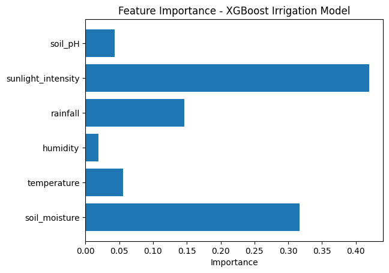
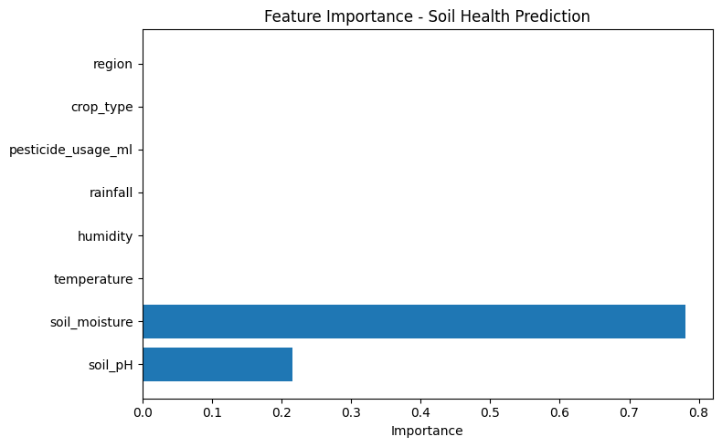

# ML Models
## 🌾 First Model: Irrigation Prediction Model

### 📋 Overview
An intelligent machine learning system that predicts irrigation needs for agricultural fields based on real-time environmental sensor data and crop characteristics. The model helps optimize water usage, reduce waste, and improve crop yields through precision agriculture.

### 🎯 Key Features
- **95% Accuracy** in predicting irrigation needs
- **Balanced Dataset** with careful handling of class imbalance
- **6 Environmental Features** for comprehensive analysis
- **XGBoost Algorithm** for robust predictions
- **Domain Knowledge Integration** with crop-specific thresholds

---

### 🔧 Model Architecture

### Algorithm: XGBoost Classifier

**Why XGBoost?**
- Handles non-linear relationships well
- Robust to outliers
- Built-in feature importance
- Efficient with tabular data
- No need for feature scaling

---

### 📊 Input Features

| Feature | Type | Range | Description |
|---------|------|-------|-------------|
| `soil_moisture` | Float | 0-100% | Current soil water content |
| `temperature` | Float | 10-45°C | Ambient air temperature |
| `humidity` | Float | 20-90% | Relative air humidity |
| `rainfall` | Float | 0-76mm | Recent precipitation |
| `sunlight_intensity` | Float | 0-1200 W/m² | Solar radiation level |
| `soil_pH` | Float | 5.5-8.5 | Soil acidity/alkalinity |

**Output:** Binary classification (0 = No irrigation, 1 = Irrigation needed)

---

### 📈 Dataset Details

### Composition
```
dataset
├── Class 0 (No irrigation)
└── Class 1 (Irrigation needed)
```

### Data Source
1. **Simulated Sensor Data**
   - Simulated farm IoT sensor readings
   - Timestamped measurements
   - Multiple crop types and regions

### Preprocessing Pipeline
```python
1. Load raw sensor data
2. Apply irrigation logic to create labels
3. Handle missing values (dropna)
4. Balance classes (original + synthetic)
5. Train-test split (80-20, stratified)
6. Train XGBoost model
```

---

## 🧮 Irrigation Logic

### Rule-Based Labeling System

**Base Moisture Thresholds (by crop):**
```python
thresholds = {
    'Potato': 60%,   # High water needs
    'Rice': 40%,     # Medium-high needs
    'Tomato': 30%,   # Medium needs
    'Peanuts': 30%,
    'Olive': 25%,    # Low needs
    'Barley': 25%,
    'Onion': 25%,
    'Corn': 25%,
    'Wheat': 20%,    # Very low needs
    'Dates': 20%
}
```

**Dynamic Adjustments:**
```python
if temperature > 30°C:    threshold += 3%
if humidity < 40%:        threshold += 2%
if sunlight > 800 W/m²:   threshold += 2%
if rainfall > 2mm:        return 0  # Override: No irrigation
```

**Decision Logic:**
```
irrigation_needed = 1 if soil_moisture < adjusted_threshold else 0
```

---

## 📊 Model Performance
### Key Metrics Explained
- **Accuracy: 95%** - Overall correct predictions
- **Precision (Irrigation): 94%** - When model says "irrigate", it's right 94% of the time
- **Recall (Irrigation): 97%** - Model catches 97% of cases that need irrigation
- **F1-Score: 0.96** - Excellent balance between precision and recall

---

## 🎯 Feature Importance

Based on XGBoost analysis:



**Insights:**
- Soil moisture is the dominant factor (as expected)
- Temperature significantly affects water evaporation
- Rainfall has strong negative correlation
- pH has minimal direct impact

---
## 🚀 Model Deployment

A Flask-based web application that predicts whether irrigation is needed based on environmental factors using a trained XGBoost machine learning model.

## 📁 Project Structure
```
irrigation-model-deployment/
│
├── app.ipynb                    # Main Flask application notebook
├── irrigation_model.pkl         # Trained XGBoost model
│
└── templates/                   # HTML templates folder
    ├── index.html              # Input form page
    └── result.html             # Prediction results page
```

## 🚀 Features

- ✅ **Web Interface**: User-friendly HTML forms for data input
- ✅ **REST API**: JSON endpoint for programmatic access
- ✅ **Real-time Predictions**: Instant irrigation recommendations
- ✅ **Multiple Input Parameters**: Considers 6 environmental factors
- ✅ **Dual Response Format**: Supports both HTML and JSON responses
- ✅ **Pre-trained Model**: Ready-to-use XGBoost classifier


## Main Interface
The user-friendly web interface allows you to input environmental parameters:


*Input form with all environmental parameters*

### Prediction Result
Get instant irrigation recommendations based on your input:


*Prediction result showing irrigation recommendation*

### Sample Data Feature
Quick testing with pre-filled sample data:


*Fill with sample data for quick testing*

## 💻 Usage

### Running with Jupyter Notebook

1. **Start Jupyter Notebook**:
```bash
   jupyter notebook
```

2. **Open `app.ipynb`**

3. **Run all cells** (Cell → Run All)

4. **Access the application**:
   - Open browser: `http://127.0.0.1:5000`

### Prediction Codes

- `1` - **Irrigation Needed**
- `0` - **No Irrigation Required**

## 📁 File Descriptions

### `app.ipynb`
Main application file containing:
- Flask app initialization
- Model loading logic
- Route definitions (`/` and `/predict`)
- Request handling for both form and JSON data

### `irrigation_model.pkl`
Serialized XGBoost model trained on irrigation dataset. Contains the trained classifier ready for predictions.

### `templates/index.html`
Homepage with input form for collecting environmental parameters from users.

### `templates/result.html`
Results page displaying prediction outcome and the input parameters used.

### `requirements.txt`
List of Python packages required to run the application.

# 🌱 Second Model: Soil Health Index Prediction Model

## 📋 Overview
A machine learning regression model that predicts soil health status based on environmental conditions, agricultural practices, and soil characteristics. The model outputs a continuous Soil Health Index (0-1 scale) to help farmers assess and improve soil quality for sustainable agriculture.

## 🎯 Key Features
- **Regression-based prediction** of soil health (0.0 = Poor, 1.0 = Excellent)
- **R² Score: 0.9987** - Extremely high prediction accuracy
- **MAE: 0.0020** - Very low prediction error
- **8 Input Features** including soil properties, climate, and farming practices
- **Color-coded health categories** for easy interpretation
- **Multi-crop and multi-region support**

---

## 🔧 Model Architecture

### Algorithm: Random Forest Regressor

**Why Random Forest?**
- Excellent for regression tasks with non-linear relationships
- Handles multiple feature types naturally
- Provides feature importance rankings
- Resistant to overfitting with proper tuning
- No need for feature scaling (but we still do it for consistency)

---

## 📊 Input Features

| Feature | Type | Range | Description | Impact |
|---------|------|-------|-------------|--------|
| `soil_pH` | Float | 5.5-8.5 | Soil acidity/alkalinity | High |
| `soil_moisture` | Float | 0-100% | Water content in soil | High |
| `temperature` | Float | 10-45°C | Ambient air temperature | Medium |
| `humidity` | Float | 20-90% | Relative air humidity | Medium |
| `rainfall` | Float | 0-76mm | Recent precipitation | Medium |
| `pesticide_usage_ml` | Float | 0-50ml | Chemical application | High |
| `crop_type` | Categorical | 10 types | Current crop planted | Low |
| `region` | Categorical | 3 regions | Geographic location | Low |

**Output:** Soil Health Index (0.0 - 1.0)
- **0.0 - 0.4**: 🔴 Poor Soil Health
- **0.4 - 0.7**: 🟡 Moderate Soil Health
- **0.7 - 1.0**: 🟢 Healthy Soil

---

## 🧮 Soil Health Index Formula

**Interpretation:**
- **pH Factor**: Optimal at 6.5 (neutral), penalties for acidity/alkalinity
- **Pesticide Impact**: Higher usage = lower health score
- **Moisture Balance**: Best at 50%, penalties for too dry/wet

---

## 📈 Model Performance

### Training Results
```
Mean Absolute Error (MAE): 0.0020
R² Score: 0.9987
```


### Feature Importance Ranking

**Key Insights:**
- **Soil pH** is the dominant factor (directly affects nutrient availability)
- **Pesticide usage** strongly impacts soil biology
- **Moisture** is critical for microbial activity
- **Climate factors** have moderate influence
- **Crop type and region** provide context but less direct impact

---

## 🧪 Test Scenarios

### Scenario 1: Optimal Conditions (Should be Healthy)
```python
{
    "soil_pH": 6.5,              # Perfect neutral
    "soil_moisture": 50,         # Ideal
    "temperature": 22,           # Mild
    "humidity": 80,              # Great
    "rainfall": 6,               # Good
    "pesticide_usage_ml": 0,     # None
    "crop_type": "Rice",
    "region": "NileDelta"
}
# Expected: 0.70+ (🟢 Healthy)
```

### Scenario 2: Poor Conditions (Should be Poor)
```python
{
    "soil_pH": 8.0,              # Too alkaline
    "soil_moisture": 30,         # Dry
    "temperature": 35,           # Hot
    "humidity": 20,              # Very dry
    "rainfall": 0,               # No rain
    "pesticide_usage_ml": 15,    # High
    "crop_type": "Tomato",
    "region": "UpperEgypt"
}
# Expected: 0.10-0.20 (🔴 Poor)
```

### Scenario 3: Moderate Conditions
```python
{
    "soil_pH": 6.1,              # Slightly acidic
    "soil_moisture": 48,         # Near optimal
    "temperature": 25,           # Good
    "humidity": 55,              # Decent
    "rainfall": 4,               # Adequate
    "pesticide_usage_ml": 2,     # Low
    "crop_type": "Olive",
    "region": "Sinai"
}
# Expected: 0.65-0.70 (🟡 Moderate)
```

---

### Best Practices
- ✅ Use as a screening tool, not definitive diagnosis
- ✅ Combine with periodic soil lab tests
- ✅ Calibrate for local soil conditions
- ✅ Monitor trends over time, not single readings
- ✅ Consider crop-specific requirements

---

