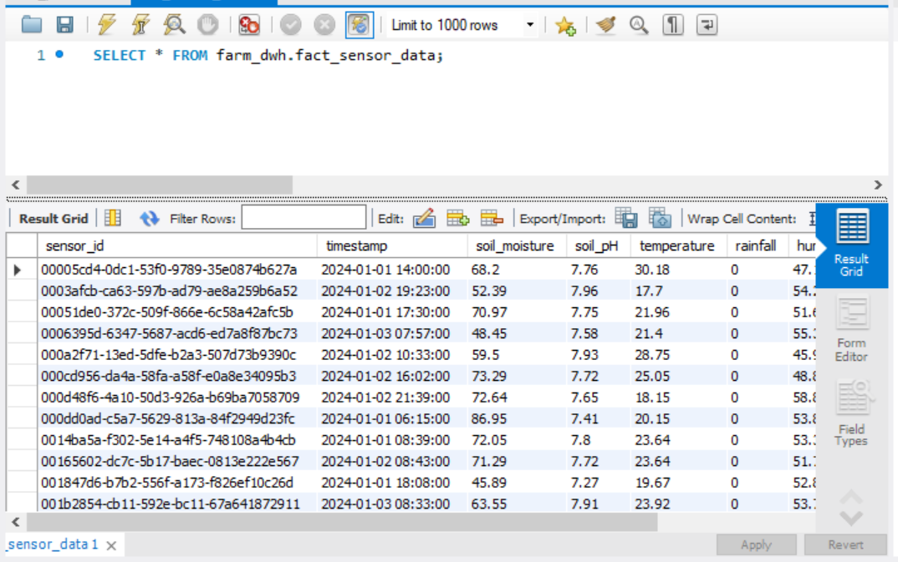
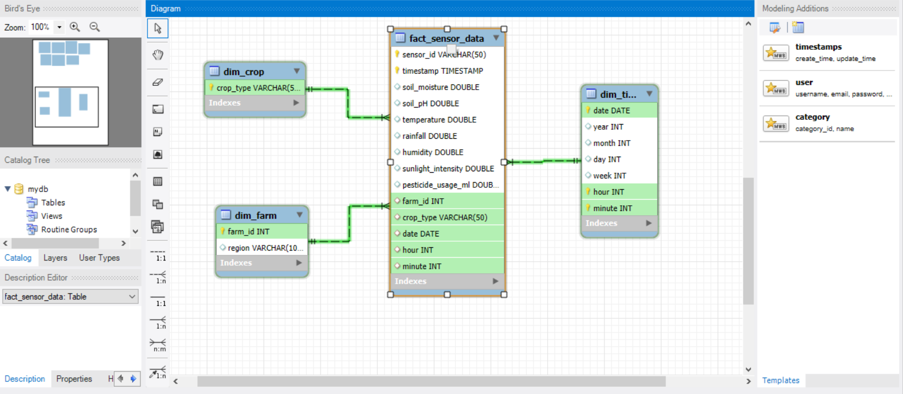

# ETL for Smart Farming Project
## Overview
This part implements an ETL pipeline to process smart farming sensor data. It reads raw data from HDFS, cleans and transforms it, calculates analytics, and loads everything into a MySQL data warehouse with **incremental loading** to prevent duplicate data processing.

The goals were:
- Clean and standardize sensor data
- Handle missing values and remove extreme outliers
- Build fact and dimension tables for analytics
- Implement incremental loading using timestamp-based checkpointing
- Prevent duplicate data through Spark deduplication and MySQL constraints
- Optimize performance by processing only new data on subsequent runs

## Key Features

### Incremental Loading System
- **Checkpoint Mechanism:** Tracks the maximum timestamp of processed data in `/tmp/last_processed_timestamp.txt`
- **Smart Filtering:** Only processes records with timestamps newer than the last checkpoint
- **First Run:** Processes all historical data and saves checkpoint
- **next Runs:** Filters and processes only new data since last run
- **No New Data Detection:** Exits when no new records are available by stopping spark so that it doesn't try to continue processing and cleaning the data

## Data Output
- **Fact table:** `fact_sensor_data`
- **Dimension tables:** `dim_farm`, `dim_crop`, `dim_time`
- **Aggregated tables:** `moisture_trend`, `rain_moisture`, `climate_effect`, `ph_trend`, `rain_pesticide`, `sunlight_daily`, `pesticide_trend`

## ETL Pipeline Steps

### 1. Spark Setup
Created a Spark session for distributed data processing.

### 2. Incremental Data Reading
- **Read from HDFS:** I read the raw data from the HDFS parquet files
- **Get last processed timestamp from checkpoint:** gets only the data that wasn't loaded before


### 3. Data Cleaning
- **Missing Values:** Fill numeric columns with mean values
- **Outlier Removal:** Use IQR method (Q1 - 1.5*IQR, Q3 + 1.5*IQR)
- **Deduplication:** Remove duplicate records using `dropDuplicates()`
- **Text Cleaning:** Trim whitespace from region and crop_type
- **Type Conversion:** Cast numeric fields to double, extract farm_id as integer

### 4. Feature Engineering
Extract temporal features from timestamp:
- Date, year, month, day, week, hour, minute

### 5. Dimensional Modeling

**Fact Table:**
- `fact_sensor_data`: All sensor readings with foreign keys and measurements

**Dimension Tables:**
- `dim_farm` → farm_id (PK), region
- `dim_crop` → crop_type (PK)
- `dim_time` → date, year, month, day, week, hour, minute 

**Aggregated Analytics Tables:**
- `moisture_trend` → Average soil moisture per farm per day
- `rain_moisture` → Total rainfall vs soil moisture per region per day
- `climate_effect` → Soil moisture vs temperature and sunlight per region
- `ph_trend` → Average soil pH per crop and region over time
- `rain_pesticide` → Rainfall vs pesticide usage correlation
- `sunlight_daily` → Total daily sunlight hours per region
- `pesticide_trend` → Pesticide usage trends by crop and region

- **Aggregated Tables in MySQL:**


### 6. Loading to MySQL
- **Mode:** `append` (incremental loads)
- **Column Types:** Explicitly defined using `createTableColumnTypes`
- **Constraints:** primary keys and composite keys prevent duplicates
- **JDBC Connection:** to directly write from Spark to MySQL

- **Example of the data loaded into the MySQL data warehouse (fact_sensor_data table):**



- **The Data Star Schema (Fact and dimension tables):**



### 7. Checkpoint Update
- **After successful load:** It updates the checkpoint with the maximum timestamp of the processed batch


## Data Integrity

### MySQL Constraints
- `dim_farm` → PRIMARY KEY (farm_id)
- `dim_crop` → PRIMARY KEY (crop_type)
- `dim_time` → Composite UNIQUE (date, hour, minute)
- `fact_sensor_data` → Composite UNIQUE (sensor_id, timestamp)

### Spark Deduplication
- `dropDuplicates()` applied on all dimension tables
- Fact table deduplicated by (sensor_id, timestamp)


## Workflow Summary
```
1. Read Parquet files from HDFS
2. Check last processed timestamp
3. Filter for new records only
4. Clean and transform data
5. Create fact/dimension tables
6. Load to MySQL (append mode)
7. Update checkpoint with new max timestamp
8. Next run processes only data after checkpoint
```
